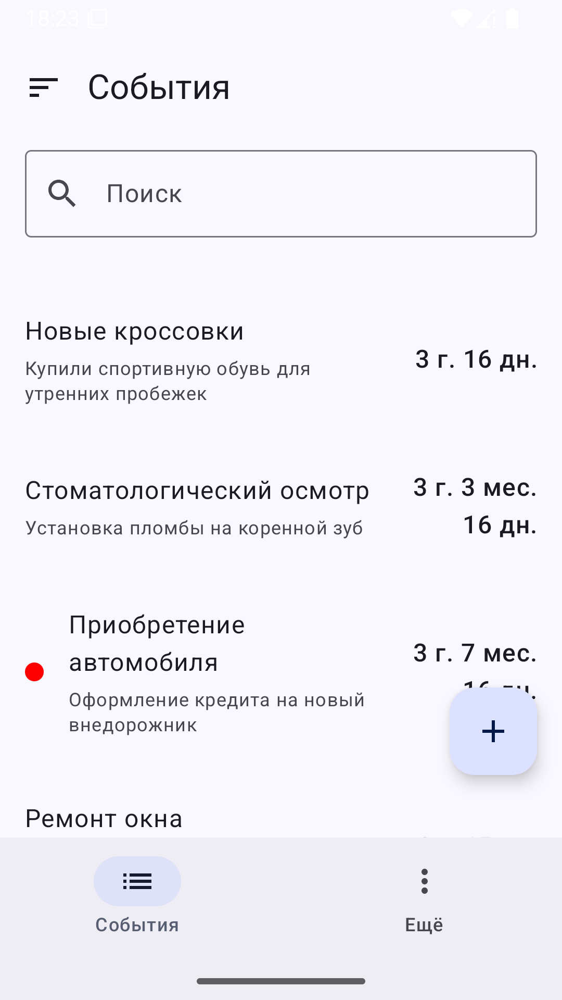
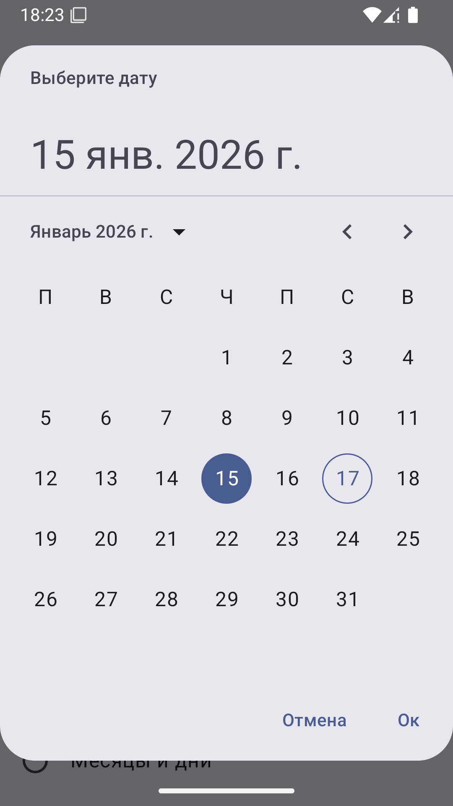
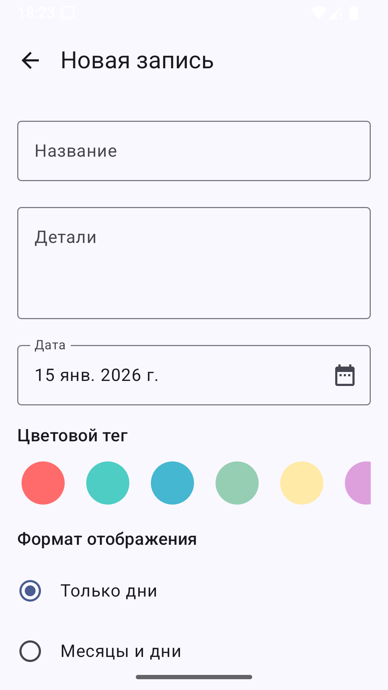
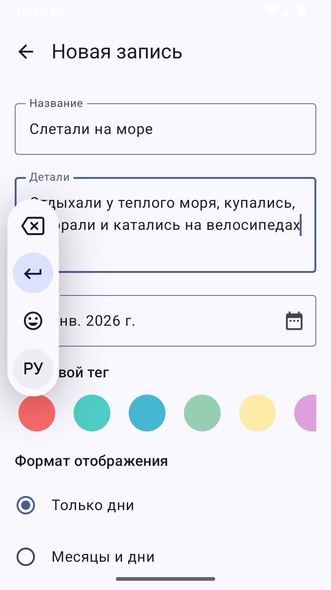
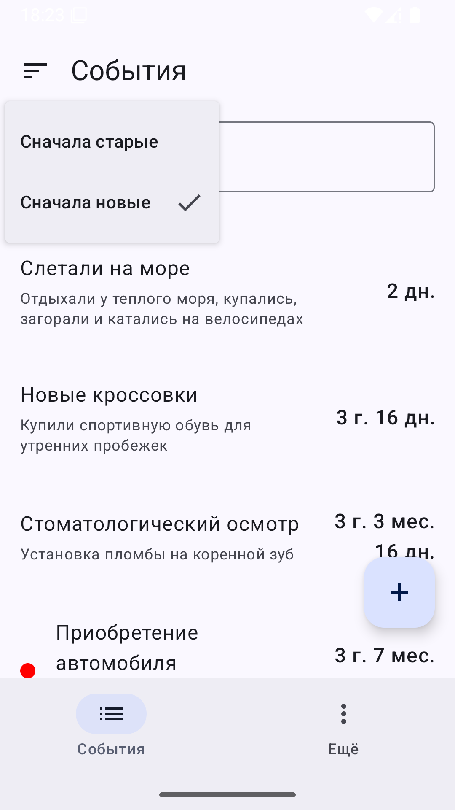

# Счётчик дней

[](https://kotlinlang.org/)
[](https://developer.android.com/)
[](https://developer.android.com/)
[](https://gradle.org/)
[](https://developer.android.com/tools/releases/gradle-plugin)
[](https://gitmcp.io/easydev991/Jetpack-Days)

- Идея приложения в том, чтобы было удобно запоминать события в указанные даты, а потом легко проверить, сколько прошло дней с момента события
- Это Android-версия моего пет-проекта "Счётчик дней", которая повторяет функциональность [iOS-версии](https://github.com/easydev991/SwiftUI-Days) для обеспечения единообразия пользовательского опыта
- Приложение работает полностью офлайн без сетевых функций
- Приложение автоматически адаптирует размер шрифтов к системным настройкам

## Что можно делать в приложении

1. Создавать/изменять/сортировать/удалять записи о событиях
2. Посмотреть, сколько дней назад произошло записанное событие
3. Выбирать опции отображения (только дни / дни и месяцы / годы, месяцы и дни)
4. Добавлять цветовые метки к записям
5. Искать и сортировать записи по названию и описанию

## Начало работы

1. Клонируйте репозиторий
2. В терминале перейдите в папку с проектом
3. Все команды доступны через `Makefile`:

- Ознакомиться с доступными командами можно, выполнив команду:

```shell
make help
```

## Скриншоты

| Список записей | Создание новой записи | Выбор опции отображения | Перед сохранением | Сортировка на главном экране |
| --- | --- | --- | --- | --- |
|  |  |  |  |  |

### Релизный процесс

Инструкция по созданию сборки и управлению версиями: [deployment.md](docs/deployment.md)
